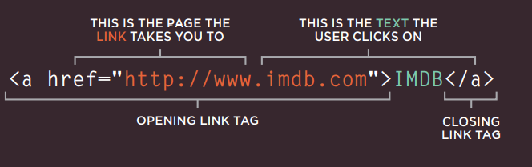

## what are ***links*** in HTML?
 ### `Links are the defining feature of the web because they allow you to  move from one web page to anothe.`
## what are kinds of links?
- Links from one website to another. 
- Links from one page to another on the same website.
- Links from one part of a web page to another part of the same page.
- Links that open in a new browser window.
- Links that start up your email program and address a new email to someone.
## how can we links the items?
### we can link items by using a tag`<a href="http://www.-----.com">name<a/>`

### we can link items and open the link in another browser by using  a tag`<a href="http://www.-----.com"target="_blank>name<a/>`

## we can link email bu using
`<a href="mailto:emailaddress@----.com">name</a>`

## CSS
## Every element in css has a block that looks like a border around the elements and in css we can organize and control this block .

### each Block-level boxes start on a new line.

## what are types of control on this block
- Normal flow This is the default behavior Every block-level elemen appears on a new line .

- Relative Positioning ` it  moves an element in relation to where it would have been in normal flow`

- bsolute positioning

- Fixed Positioning  it positions the element in relation to the browser window and it type of absolute positioning.

- Floating Elements  allow you to take the element where do you want and allow othe elemwnt float aronund it.
