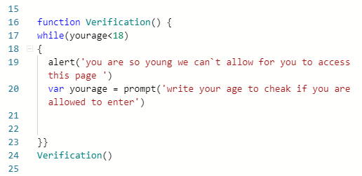

## What do you mean by ***Function*** ?
### `**JavaScript function is a block of code designed to perform a particular task.**`
### What is the benefit of using the functions in js ?
*Functions keeps the program organized.

*makes it reusable.

*programs are easier to read and write.

## What is function`s syntax?
>function name(parameter1, parameter2, parameter3) {
code to be executed
}

## write a real syntax of function .
