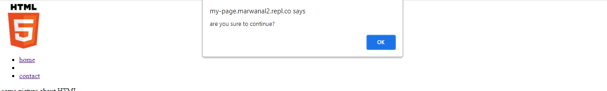
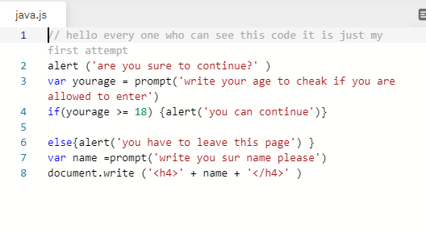

## what is ***java script*** ?
### js is programming language that we use it to make **effects** to our page .

## what do you mean by ` make effects`?
### it is mean that we can make a dynamic page that allow for the visitor interact with it.

## write some steps for making any effect by javascript .
### we can make pop up box by this syntax
 * alert("are you sure to continue")
 
 

 ## example of js syntaxes by my hand
 

