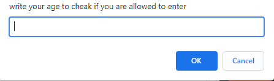

## what is the meaning of ***loops*** in programing ?
### it is a function or group of functions that we use them in js for making something.
## write some of these loops 
- **for syntax**
- **while syntax**
## what is the deffrence between these loops?
### we use while syntax to keep doing something ex the page keep asking the user to write his name until he write it .
### on the other hand we use for syntax to do something the user wants to do  ex if the user want to see specific number of products we use the for .

## we need a real ex about loops .
### while syntax

### for syntax

