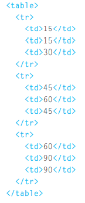
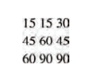
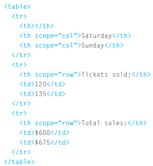
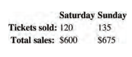

# tables
## What's a ***Table***?
> ### A table represents information in a grid format.
## what the addvantage of tables?
> ### Grids allow us to understand complex data by referencing information on two axes.
## how can we creat a table in HTML?
### `<table><table/>`The <table> element is used to create a table.
### `<tr><tr/>` You indicate the start of each row using the opening `<tr>` tag.
### `<td><td/>` Each cell of a table is represented using a `<td>`element.

## `<th><th/>` The <th> element is used just like the `<td>` element but its purpose is to represent the heading for either a column or a row.

