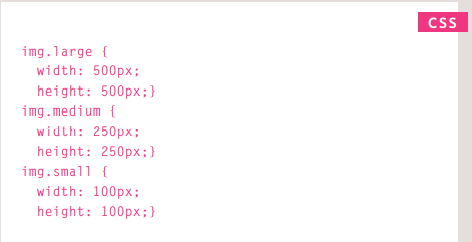
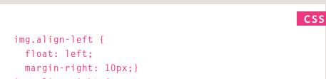
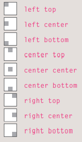

# ***image***
## how can we add imades to our page?
### we can add the images by ` tag` `` 
## how can we control the size of the images?
### we can change the size by  using the `width and height properties in CSS`

## how can we control the location of the image?
### by using`float` ex if we want to put the image on the left ,in css we target the image then write float

## ***backgrond image***
### we can put an image as a back ground by using in css `{background-image: url("")}`
how can control the backgrond image?
### we can by using in css `{background-position: center top; or center center or rihgt bottom ...........}`

# ***audio vedio***
## how can we add audio video to uor page?
### in html we can add them by `<video> and <audio>`

`<video controls or autoplay or autoplay muted>`
`<source src="video name.mp4" type="video/mp4">`
`<source src="video name.ogg" type="video/ogg">`
`</video>`
<video controls or autoplay or autoplay muted>
<source src="video name.mp4" type="video/mp4">
<source src="video name.ogg" type="video/ogg">
</video>

### for audio
`<audio controls>`
`<source src="audio name.ogg" type="audio/ogg">`
`<source src="audio name.mp3" type="audio/mpeg">`
`</audio>`
<audio controls>
<source src="audio name.ogg" type="audio/ogg">
<source src="audio name.mp3" type="audio/mpeg">
</audio>
