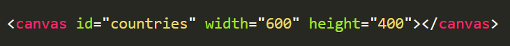
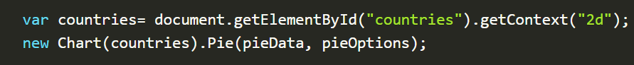

# ***Charts***
## Charts are far better for displaying data visually than tables . At first sight a `<canvas>` looks like the `` element, with the only clear difference being that it doesn't have the src and alt attributes., the <canvas> element has only two attributes, width and height
## how can create a chrat in html 
### we can by `<canvas ></canvas>`

## how can we view the chart on the page?
### befor that we have to determine the rendering context of the chart by 
### `getContext()` on the javascirt  and we can put as a 2d or 3d 

