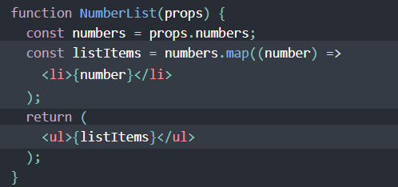

# list and key
## gow can we make list in react?
- we loop through the numbers array using the JavaScript map() function. We return a `<li>` element for each item. Finally, we assign the resulting array of elements to listItems
- We include the entire listItems array inside a `<ul>` element

## when you create a list you should provide it with a ***key***

## what do you mean by ***key***?
> ### “key” is a special string attribute you need to include when creating lists of elements`
> ### Keys help React identify which items have changed, are added, or are removed. Keys should be given to the elements inside the array to give the elements a stable identity`
### Each list item needs a unique key

# Spread Operator

## What is the ***spread operator***?
> ### JavaScript, spread syntax refers to the use of an ellipsis of three dots (…) to expand an iterable object into the list of arguments.

## what is the benfet from ***spread operator***
> ### The spread operator is a useful and quick syntax for adding items to arrays, combining arrays or objects, and spreading an array out into a function’s arguments.

What else can … do?
The … spread operator is useful for many different routine tasks in JavaScript, including the following:
- Copying an array
- Concatenating or combining arrays
- Using Math functions
- Using an array as arguments
- Adding an item to a list
- Adding to state in React
- Combining objects
- Converting NodeList to an array
