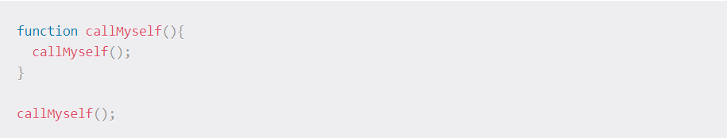
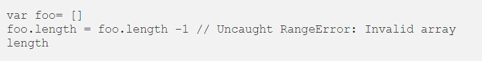
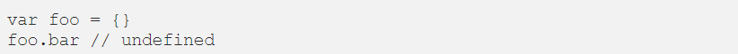

# Call Stack

## What is a ‘call’?

> ###  is a data structure that uses the Last In, First Out (LIFO) principle to temporarily store and manage function invocation (call).

## What causes a stack overflow?

### A stack overflow occurs when there is a recursive function (a function that calls itself) without an exit point.

# JavaScript error messages

## What is a ‘refrence error’?

### This is as simple as when you try to use a variable that is not yet declared you get this type os errors.

## What is a ‘syntax error’?

###  this occurs when you have something that cannot be parsed in terms of syntax,

## What is a ‘range error’?

## What is a ‘tyep error’?

### Like the name indicates, this types of errors show up when the types (number, string and so on) you are trying to use or access are incompatible,

## What is a breakpoint?

### a point in the program where the code will stop executing

