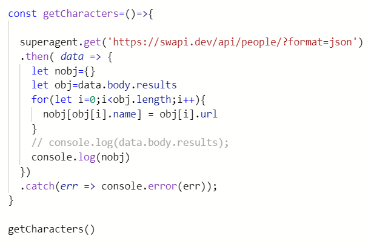
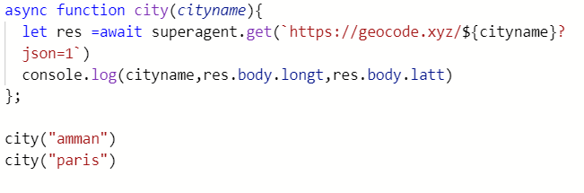

## Array.map():map() method is used to iterate over an array.

## Array.reduce(): method executes a reducer function for each value of an array and returns a single value which is the function's accumulated result.

## using superagent()

### With normal Promise .then() syntax

### Again with async / await syntax

### promises: is an object that represents the eventual completion (or failure) of an asynchronous operation, and its resulting value.

## A Promise is in one of these states:

- pending: initial state, neither fulfilled nor rejected.
- fulfilled: meaning that the operation was completed successfully.
- rejected: meaning that the operation failed.

## Are all callback functions considered to be Asynchronous?
###  Callbacks are not asynchronous by nature ,ny function can become a callback function if it is passed as an argument.