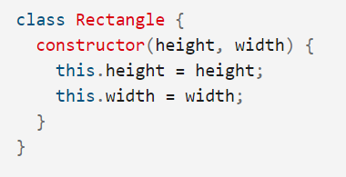
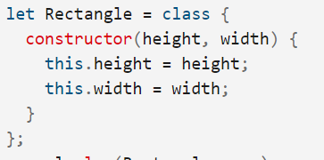

## Express REST API

## Name 3 real world use cases where you’d want to change the request with custom middleware
- logger middleware
- bad request middleware
- Optimization applications middleware
## True or false: The route handler is middleware?
# false
# Document the following Vocabulary Terms
## Middleware : software that lies between an operating system and the applications running on it. Essentially functioning as hidden translation layer, middleware enables communication and data management for distributed applications.

## request object:the main entry point for an application to issue a request to the Library - all operations on a URL must use a Request object.
## Response Object: represents the HTTP response that an Express app sends when it gets an HTTP request.
## Application Middleware: is a global middleware that interrupts every route and doing some lines of written code .
## Routing Middleware: he routing has been implemented as middleware
## Test Driven Development:(TDD) a software development practice that focuses on creating unit test cases before developing the actual code.

## Behavioral Testing: a testing of the external behaviour of the program, also known as black box testing It is usually a functional testing.
# Preview
### Which 3 things had you heard about previously and now have better clarity on?
- TDD
- whiteboard
- cd/ci
### Which 3 things are you hoping to learn more about in the upcoming lecture/demo?
- sql database
- algorithms
- authentication
## What are you most excited about trying to implement or see how it works?
### relation sql 

## Classes: are  special functions, and just as you can define function expressions and function declarations.
### the class syntax has two components
- Class declarations

- Class expressions

### Class body 
#### The body of a class is the part that is in curly brackets {}. This is where you define class members, such as methods or constructor.
- Constructor :The constructor method is a special method for creating and initializing an object created with a class.

## Routing:Routing refers to how an application’s endpoints (URIs) respond to client requests.
### Route methods ,A route method is derived from one of the HTTP methods, and is attached to an instance of the express class.
- get 
- put
- post
- delete
### Route paths:in combination with a request method, define the endpoints at which requests can be made. Route paths can be strings, string patterns, or regular expressions.

### Route parameters: are named URL segments that are used to capture the values specified at their position in the URL. 
### Route handlers: callback functions that behave like middleware to handle a request.
### Response methods

| Method |	Description|
|  |  |
| res.download() |	Prompt a file to be downloaded.|
| res.end() |	End the response process.|
| res.json() |	Send a JSON response.|
| res.jsonp()	 |Send a JSON response with JSONP support.|
| res.redirect() |	Redirect a request.|
| res.render() |	Render a view template.|
| res.send() |	Send a response of various types.|
| res.sendFile() |	Send a file as an octet stream.|
| res.sendStatus() |	Set the response status code and send its string representation as the response body.|

## express.Router :It is a mini express application without all the bells and whistles of an express application, just the routing stuff.

### Use the express.Router class to create modular, mountable route handlers. A Router instance is a complete middleware and routing system; for this reason, it is often referred to as a “mini-app”.
