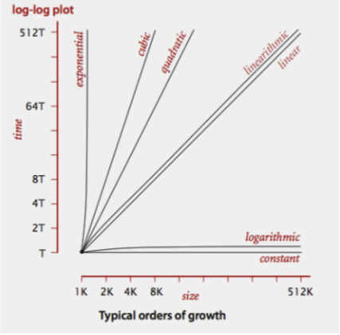
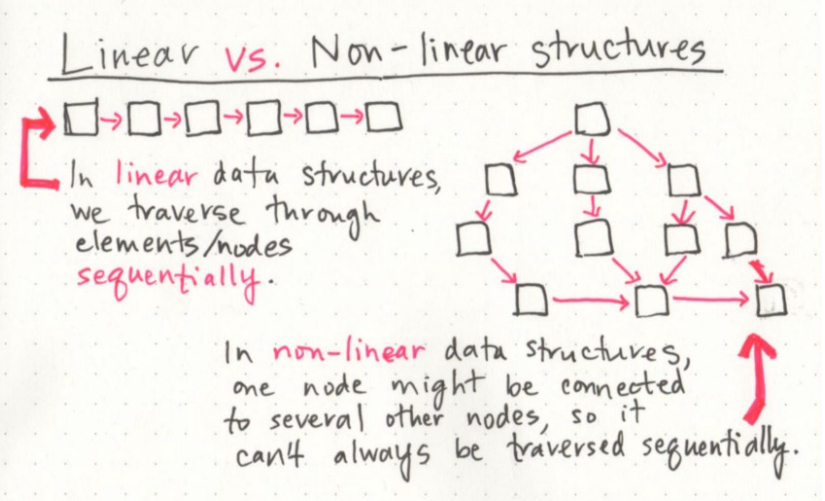
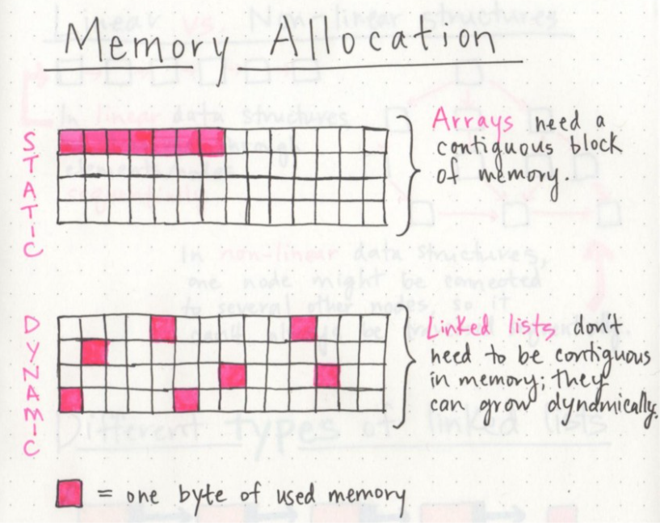
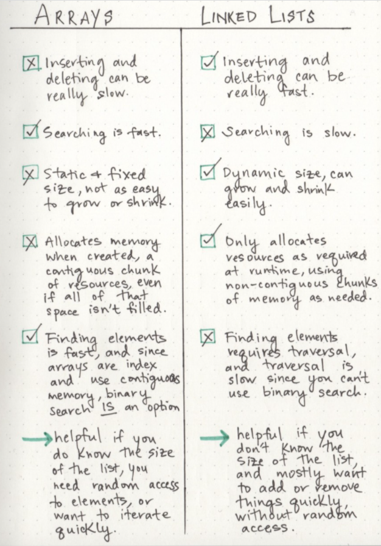

# Big O

## Big O(oh) notation: is used to describe the efficiency of an algorithm or function
## Big O based on 2 factors:
- Running Time:The amount of time a function needs to complete.
- Memory Space:The amount of memory resources a function uses to store data and instructions.

## Input Size :the size of the parameter values that are read by the algorithm.
### Example: If a function uses an array or list as one parameter, then the number of elements within that array or list will directly increase the Input Size of that parameter.
### The higher this number, the more likely there will be an increase to Running Time and Memory Space.
## Units of Measurement

### In order to quantify the Running Time in our analysis, we will consider Three Measurements of time:
- The time in milliseconds from the start of a function execution until it ends.
- The number of operations that are executed.
- The number of “Basic Operations” that are executed.
### In order to quantify Memory Space, we can consider Four Sources of Memory Usage during function run-time:

- The amount of space needed to hold the code for the algorithm.
- The amount of space needed to hold the input data.
- The amount of space needed for the output data.
- The amount of space needed to hold working space during the calculation.

## Always be aware that Space Complexity and Time Complexity are measured differently and should be analyzed separately.

## Orders of Growth : represents the increase in Running Time or Memory Space.
- Constant Complexity means that no matter what inputs are thrown at our algorithm, it always uses the same amount of time or space.
- Logarithmic Complexity represents a function that sees a decrease in the rate of complexity growth, the greater our value of n.
- Linear Complexity  the size of our inputs ‘n’ will directly determine the amount of Memory Space used and Running Time length.ex very common efficiency and is usually used to denote functions with loops
- Linearithmic Complexity This represents complexity that grows with n, but also by lgn 
- Quadratic Complexity describes an algorithm with complexity growing at a rate of input size n multiplied by n. ex nested loops
- Cubic Complexity  is typically just a higher degree of what makes the quadratic complexity grow at such a high rate. 
- Exponential Complexity represents very rapidly growing complexity, ex The fibonacci sequence is a popular case for exponential complexity growth.
- Factorial Complexity  means that the our space and time requirements grow extremely fast, relative to our input size. ex how many ways could you arrange a deck of cards?

## Worst Case, Best Case, Average Case
- Worst Case:his case runs the longest for all possible inputs of n.
- Worst Case:This case runs the quickest for all possible inputs of n.
- The average case makes a typical assumption about the possible inputs of size ‘n’ and how they might affect efficiency. 

# Linked Lists
## is a sequence of Nodes that are connected/linked to each other.(that each Node references the next Node in the link.
)

## Singly:Singly refers to the number of references the node has. A Singly linked list means that there is only one reference, and the reference points to the Next node in a linked list.
## Doubly : Doubly refers to there being two (double) references within the node
## Node : Nodes are the individual items/links that live in a linked list.
## Next :This property contains the reference to the next node.
## Head :The Head is a reference of type Node to the first node in a linked list.
## Current: The Current is a reference of type Node to the node that is currently being looked at

`In the world of software, the ways that we choose to organize our information is half the battle.`
# linear data structures, which means that there is a sequence and an order to how they are constructed and traversed.
`We can think of a linear data structure like a game of hopscotch`

##  In non-linear data structures, items don’t have to be arranged in order, which means that we could traverse the data structure non-sequentially.

- Trees and graphs are also non-linear data structures
- when we use arrays in our code, we’re implementing a linear data structure
## Memory management
### When an array is created, it needs a certain amount of memory. If we had 7 letters that we needed to store in an array, we would need 7 bytes of memory to represent that array. But, we’d need all of that memory in one contiguous block.
### On the other hand, when a linked list is born, it doesn’t need 7 bytes of memory all in one place. One byte could live somewhere, while the next byte could be stored in another place in memory altogether! Linked lists don’t need to take up a single block of memory.
memorymaneg

> The fundamental difference between arrays and linked lists is that arrays are static data structures, while linked lists are dynamic data structures.
## The fundamental difference
`The fundamental difference between arrays and linked lists is that arrays are static data structures, while linked lists are dynamic data structures. A static data structure needs all of its resources to be allocated when the structure is created; this means that even if the structure was to grow or shrink in size and elements were to be added or removed, it still always needs a given size and amount of memory. If more elements needed to be added to a static data structure and it didn’t have enough memory, you’d need to copy the data of that array, for example, and recreate it with more memory, so that you could add elements to it.   On the other hand, a dynamic data structure can shrink and grow in memory. It doesn’t need a set amount of memory to be allocated in order to exist, and its size and shape can change, and the amount of memory it needs can change as well.`

# a linked list is usually efficient when it comes to adding and removing most elements, but can be very slow to search and find a single element.
## to do something that requires a lot of traversal, iteration, or quick index-level access, a linked list could be your worst enemy. In those situations, an array might be a better solution
compare-array-vs-linklist
