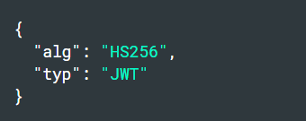
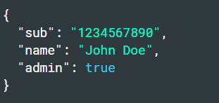
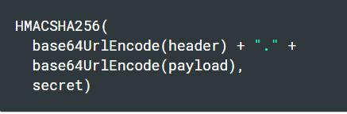

# Review, Research, and Discussion
## Write the following steps in the correct order:
- Register your application to get a client_id and client_secret
- Ask the client if they want to sign in via a third party
- Make a request to a third-party API endpoint
- Redirect to a third party authentication endpoint
- Receive authorization code
- Receive access token
- Make a request to the access token endpoint
 

## What can you do with an access token?
- Access tokens are used in token-based authentication to allow an application to access an API.
## What can you do with an authorization code?
- An authorization code is an alphanumeric password that authorizes its user to purchase.
## What’s a benefit of using OAuth instead of your own basic authentication?
- It enables apps to obtain limited access (scopes) to a user's data without giving away a user's password.

# Document the following Vocabulary Terms
## Client ID:is a public identifier for apps.
## Client Secret: is a secret known only to your application and the authorization server.
## Authentication Endpoint:is a security mechanism designed to ensure that only authorized devices can connect to a given network, site or service.
## Access Token Endpoint:where apps make a request to get an access token for a user.
### api endpoint :is one end of a communication channel.
### Authorization Code:a temporary code that the client will exchange for an access token. 
###  access token : an opaque string that identifies a user, app, or Page and can be used by the app to make graph API calls.
# Preview
## Which 3 things had you heard about previously and now have better clarity on?
- Access Token
- middelware
- algorithem
## Which 3 things are you hoping to learn more about in the upcoming lecture/demo?
- authintication
- datastucture
- hook 
### What are you most excited about trying to implement or see how it works?

## What is JSON Web Token?
### JSON Web Token (JWT) is an open standard (RFC 7519) that defines a compact and self-contained way for securely transmitting information between parties as a JSON object. This information can be verified and trusted because it is digitally signed.
### When should you use JSON Web Tokens?
- Authorization: This is the most common scenario for using JWT. Once the user is logged in, each subsequent request will include the JWT, allowing the user to access routes, services, and resources that are permitted with that token.
- Information Exchange: JSON Web Tokens are a good way of securely transmitting information between parties
 
## What is the JSON Web Token structure?
- Header

- Payload

- Signature

## Why should we use JSON Web Tokens?
- As JSON is less verbose than XML, when it is encoded its size is also smaller, making JWT more compact than SAML. This makes JWT a good choice to be passed in HTML and HTTP environments.
- JSON parsers are common in most programming languages because they map directly to objects.

## If you can decode JWT, how are they secure?

### JWTs can be either signed, encrypted or both. If a token is signed, but not encrypted, everyone can read its contents, but when you don't know the private key, you can't change it. Otherwise, the receiver will notice that the signature won't match anymore.