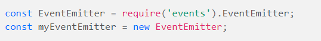
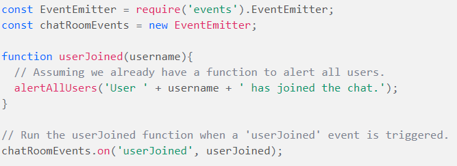
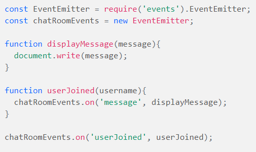
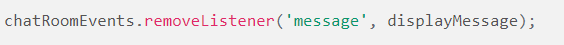
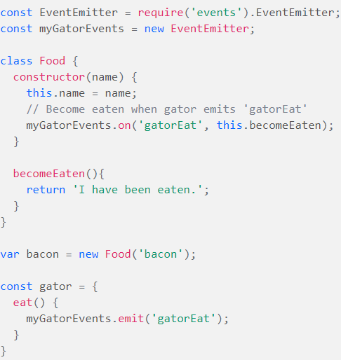

# Event Driven Applications
## Why is access control important?
### it is a valuable security technique that can be used to regulate who or what can view or use any given resource.
## Describe an application that would need access control.
### chats application
## What is a role used for?
### help you grant and manage sets of privileges for various categories of users, rather than grant those privileges to each user individually.
## Why is role based access control more scalable than discretionary or mandatory access control?
### RBAC provides access to resources or information based on user roles,
# terms
## Authorization: a security mechanism used to determine user/client privileges or access levels related to system resources.
##  Role Based Access Control:is an approach to restricting system access to authorized users. It is an approach to implement mandatory access control or discretionary access control. 
## capabilities:used to control access to system resources.
# Preview
## Which 3 things had you heard about previously and now have better clarity on?
- npm
- depuging
- algorithms
## Which 3 things are you hoping to learn more about in the upcoming lecture/demo?
- sql relations
- psql
- authentication and authorization
## What are you most excited about trying to implement or see how it works?
- hook

# Event-Driven Programming
## Event-Driven Programming :is a logical pattern that we can choose to confine our programming within to avoid issues of complexity and collision. 
> ## every time you interact with a webpage through it’s user interface, an event is happening. When you click a button a click event is triggered. When you press a key a keydown event is triggered.
## Event-Driven Programming makes use of the following concepts:

- an Event Handler is a callback function that will be called when an event is triggered.
- A Main Loop listens for event triggers and calls the associated event handler for that event.
`Node.js natively provides us with a useful module called EventEmitter that allows us to get started incorporating Event-Driven Programming in our project right away`
## create a new object from the class to start using it.

## ex  how to use EventEmitters(want to alert everyone when a new user joins the chat room.)

## Removing Listeners
###  we can use the removeListener or removeAllListeners method.

# Object Oriented Programming + Event-Driven Programming
-The Object Oriented approach promotes the idea that all behavior of an individual unit (or object) be handled from code within that unit. Using this approach, applications are built with many different units that all speak to and interact with each other.

